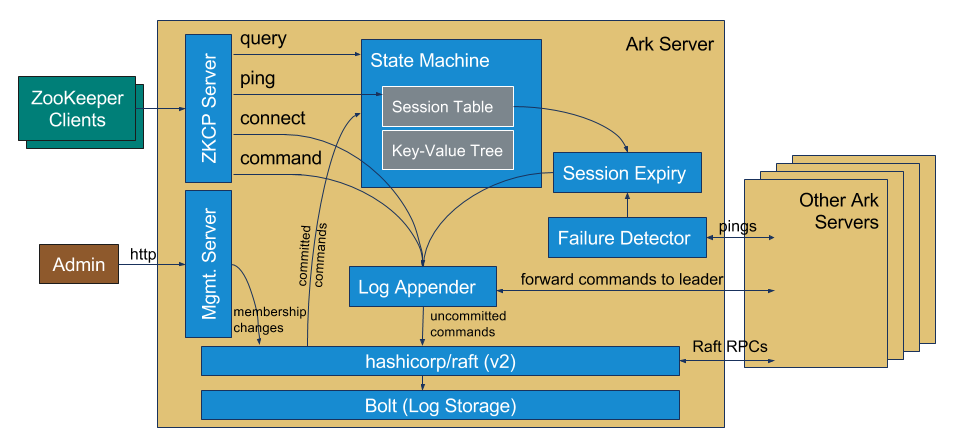

# Ark: a ZooKeeper implementation

[Apache ZooKeeper](https://zookeeper.apache.org/) is a popular coordination system that's used in many open source projects, including Apache HBase and Apache Kafka. Started in 2007, Apache ZooKeeper is written in Java and embeds a consensus algorithm called ZAB (ZooKeeper Atomic Broadcast). Clients access a ZooKeeper cluster via a client library. Apache ZooKeeper includes a C and Java client library, and other unofficial libraries exist for other languages. The [Apache Curator](http://curator.apache.org/) library for Java is often recommended to make accessing ZooKeeper safer and more convenient.

Ark is another implementation of the ZooKeeper client protocol, the protocol that ZooKeeper clients use to speak to ZooKeeper servers. Note that Ark is not associated with Apache or the Apache ZooKeeper project. Ark consists of several components, all in this repository:

 - A Go client library for ZooKeeper. The Ark client works with both Apache ZooKeeper clusters and Ark clusters.
 - A clustered server implementation, written in Go and built upon the [hashicorp-raft](https://github.com/hashicorp/raft/) library. An Ark cluster works with both Apache ZooKeeper clients and Ark clients.
 - A proxy that sits between ZooKeeper clients and servers and prints out the messages transmitted in full detail.
 - RFC-style documentation of the ZooKeeper client protocol.
 - A set of automated tests to check or validate the behavior of ZooKeeper server implementations.

<h3 style="color:red">
Ark was written as a proof-of-concept. It seems to work in the happy case, but it's not well-documented or well-tested. It's not recommended for production use. We've made the code and documentation available for others to learn from or improve upon. We have no plans to support this project or continue work on it.
</h3>

Ark was written by Diego Ongaro at Salesforce in 2016. The name refers to Noah's Ark, which is sort of what you get when you place a zookeeper on a raft. Ark was part of an investigation into (a) whether implementing a ZooKeeper server with a Raft library could be substantially simpler than Apache ZooKeeper, and (b) how best to operate large numbers of ZooKeeper clusters with minimal human involvement. Ark turned out to be a lot of fun to work on, so Diego maybe went a bit too far beyond a little proof-of-concept :) .

## Status

Ark is alpha quality. Please give it a spin and report issues here, though we aren't likely to fix them soon.

Ark servers implement nearly all client-visible features found in Apache ZooKeeper v3.5, including transactions (multi-ops) and TLS. However, Ark does not yet implement:
 - SASL or Kerberos authentication,
 - [Quotas](https://zookeeper.apache.org/doc/trunk/zookeeperQuotas.html),
 - TTLs (ZOOKEEPER-2169, expected in Apache ZooKeeper v3.6),
 - State machine snapshot/restore (the Raft log will grow without bound).

If any other operations are missing or if you discover unintentional differences in behavior between Ark servers and Apache ZooKeeper servers, please file issues.

At this point, we're not making any promises about compatibility during Ark server upgrades. If you want to upgrade your Ark cluster, you should blow away the store directories on the servers' filesystems first.

Note that Ark servers do not implement ZAB, so it is not possible to run a mixed cluster with Apache ZooKeeper servers and Ark servers. Also, Ark servers do not implement ZooKeeper's administrative/management protocols (Ark presents a RESTful API instead).

## Getting started

Install the Go compiler (v1.7+) and set up your `$GOPATH`.

    mkdir -p $GOPATH/src/github.com/ongardie
    git clone --recursive https://github.com/ongardie/ark.git $GOPATH/src/github.com/ongardie/ark
    cd $GOPATH/src/github.com/ongardie/ark
    go get -x
    go build -x

The binary `./ark` is the Ark server. Run `./ark -h` for usage.

If you just want to get started quickly on localhost, run `./start3.sh clean`, which will do the following:

 1. Blow away the store directories, if any.
 2. Generate a TLS self-signed keypair.
 3. Initialize server 1's store directory to have a cluster membership configuration of just itself.
 4. Launch 3 servers, all on localhost, listening for clients on ports 2181, 2182, and 2183 over cleartext, as well as 2281, 2282, and 2283 over TLS.
 5. Request server 1 to add servers 2 and 3 to the cluster.
 6. Block until the servers exit.

Otherwise, you can follow the same steps as `start3.sh`, but run the servers on different physical machines. (It's a short script and fairly readable, so there's not much benefit to duplicating that here.)

### Running client proxy

Another useful program found in this repository is a proxy that sits between ZooKeeper clients and servers and prints out the messages transmitted in full detail. For example, the following will listen on localhost port 2180 and forward all requests to port 2182:

    go run proxy/main.go 127.0.0.1:2180 127.0.0.1:2182

### RFC for ZooKeeper Client Protocol

Since the ZooKeeper client protocol hasn't been precisely documented in the past, this repo attempts to do so using the RFC format. To generate `docs/zkcp-rfc.html`, run:

    xml2rfc --html docs/zkcp-rfc.xml

## Ark server implementation notes

By using hashicorp-raft in a Replicated State Machine architecture, the Ark server has a clean separation between its state machine and consensus algorithm. It also supports dynamic membership changes. Presently, Ark servers use [boltdb](https://github.com/boltdb/bolt) for persisting the log to disk.

Here's an Ark-itecture diagram:

### Request handler

As defined by Apache ZooKeeper, the client protocol includes a minimal amount of framing within a TCP connection (just 4 bytes to designate the length of each message). After connection initialization, all requests include a header (`proto.RequestHeader`) with a request counter (`xid`) and opcode. The opcode is used to distinguish read-write commands from read-only queries. Read-write commands are inserted into the Raft log with no further interpretation (they are proxied to the leader if needed, as described below). Read-only queries are passed to the state machine, where they will soon be decoded and processed.

### State machine

The state machine maintains a `statemachine.Tree` structure as the primary data structure that clients interact with. This is implemented as an immutable (copy-on-write) tree, so that snapshotting can proceed concurrently with applying log commands.

The state machine tracks sessions and watches (notifications) outside the Tree. This seems to fit well with the client API, which allows a watch to be set on the existence of `/a/b/c/d/e/f`, even if `/a` does not yet exist. It also permits the side effects of sending notifications to be hidden from the Tree.

The state machine encodes and decodes requests using the simple "Jute" encoding scheme. This and many request and response struct definitions were lifted from Samuel Stauffer's [go-zookeeper](https://github.com/samuel/go-zookeeper/) library, a BSD3-licensed client library for ZooKeeper written in Go.

### Preserving client request order

Apache ZooKeeper guarantees that request n+1 from a client will not be processed before request n from that client. For example, a client can issue create, setData, getData, and delete requests without waiting for the responses in between, and if the requests occur at all, they must occur in that order. Meanwhile, performance for some clients depends on these requests all being pipelined.

Preserving client request order requires some care:
 - hashicorp-raft itself does not guarantee ordering until requests are added to the Raft log (when `raft.Apply()` returns the future).
 - When commands are proxied to the leader and as leadership changes, this order must be preserved.
 - Although queries are not added to the log, they must be processed after earlier commands and before later ones.

Ark servers number commands as they arrive from clients, and the state machine ignores commands in the Raft log that are not numbered sequentially (within a connection). Ark takes a best-effort approach to placing commands in the Raft log in the right order, and it closes off a client's connection if its commands somehow ended up in the Raft log out of order (we expect this to be rare, and Apache ZooKeeper seems to close all client connections on every leader change).

Queries are handed off to the server's local state machine, along with the command number they must follow. Queries are delayed until that command has completed and are executed immediately after the command has been applied.

### Session management

Session expiration is important in ZooKeeper because of ephemeral nodes: nodes in the tree that are supposed to be removed when the client's session expires.

Apache ZooKeeper clients connect to any server to establish a long-lived session and a current connection. Upon connection, the client requests a desired session timeout, and the server returns the actual session timeout. Any request on that session (read-only or not) keeps the session alive. The Apache ZooKeeper Java client sends empty ping requests every one-third of session timeout during periods of inactivity. If it has not received a pong after two-thirds of the session timeout, it will try to continue its session with a new connection to a different server.

A client never assumes that its session has expired but is only told so by the servers. The servers should expire a client's session after a session timeout with no client activity during which the cluster has been operational (additional time should be given following leader changes and cluster outages).

Ark uses a two-level approach to session management, sending only O(servers) keep-alive traffic between servers. At the lower level, individual servers manage individual client sessions. At the higher level, the leader monitors the health of the other servers. In support of this, client connection requests and server-generated session expiration requests are both submitted as commands to the Raft log, so that sessions are tracked as part of the replicated state machine.

At the lower level, the latest server that a client connects to ("the session owner") is responsible for expiring the client's session. It receives requests and pings from the client, and waits for a session timeout to go by without hearing any. In that event, it tries to expire the session by submitting a request to the Raft log (typically this has to be sent over the network to the leader first). This request is conditioned on the connection ID being the latest from the client.

The above handles the case where a client fails but the servers are all healthy, or the connection between a client and its session owner fails. The higher-level mechanism is needed to handle failures of the session owner and network partitions between the leader and the session owner.

The servers send heartbeats to each other periodically. The session owner will disconnect the client and stop sending pongs once if it has not heard from the leader after two-thirds the client session timeout, allowing the client to try another server. A leader will expire a session (using a log entry) if twice the client's session timeout has gone by without hearing from the session owner, as long as it's been leader for the same term during that entire time.
